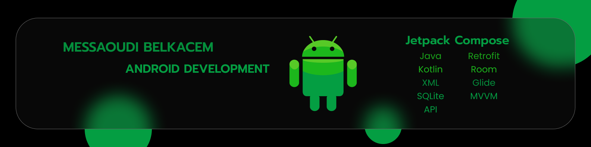

<h1 align="center">Hi 👋, I'm Messaoudi Belkacem</h1>
<h3 align="center">A passionate Android developer from Algeria</h3>

 
   

- 🌱 I’m currently learning **Java Spring, React, and Node**

- 💬 Ask me about **Android, Jetpack Compose, and Kotlin**

- 📫 How to reach me **wailmessaoudi806@gmail.com**

<h3 align="center">Connect with me:</h3>

  
  
  

<h3 align="center">Languages and Tools:</h3>

  
  
  
  
  
  
  
  
  
  
  
  
  
  
  

